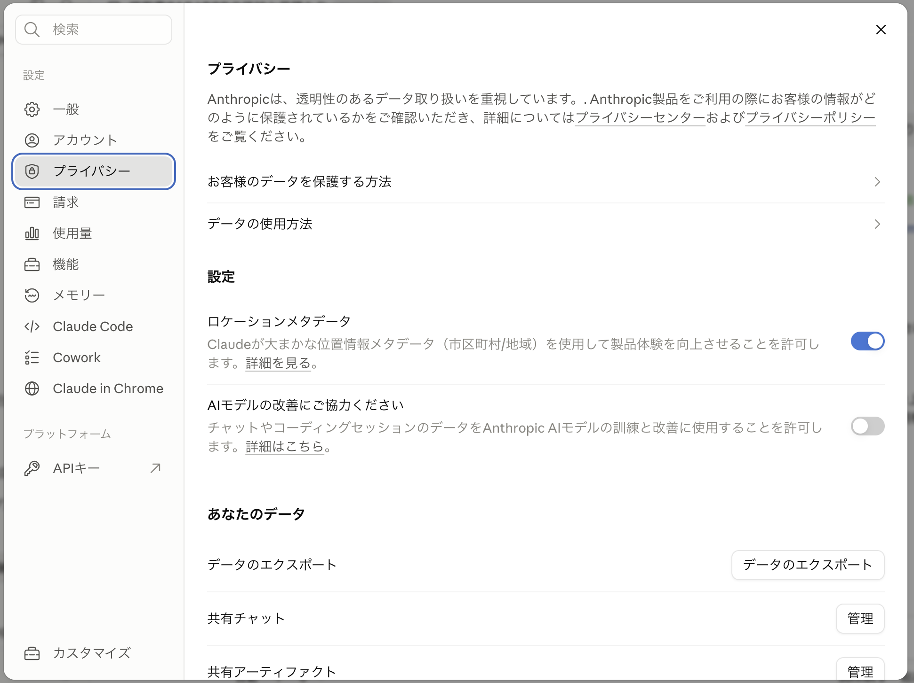
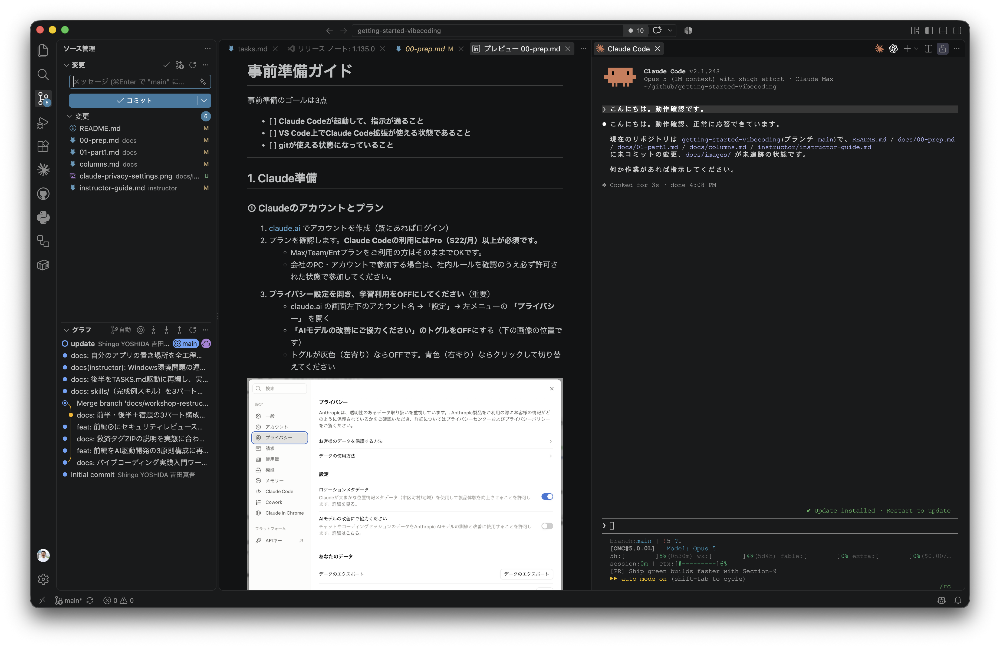
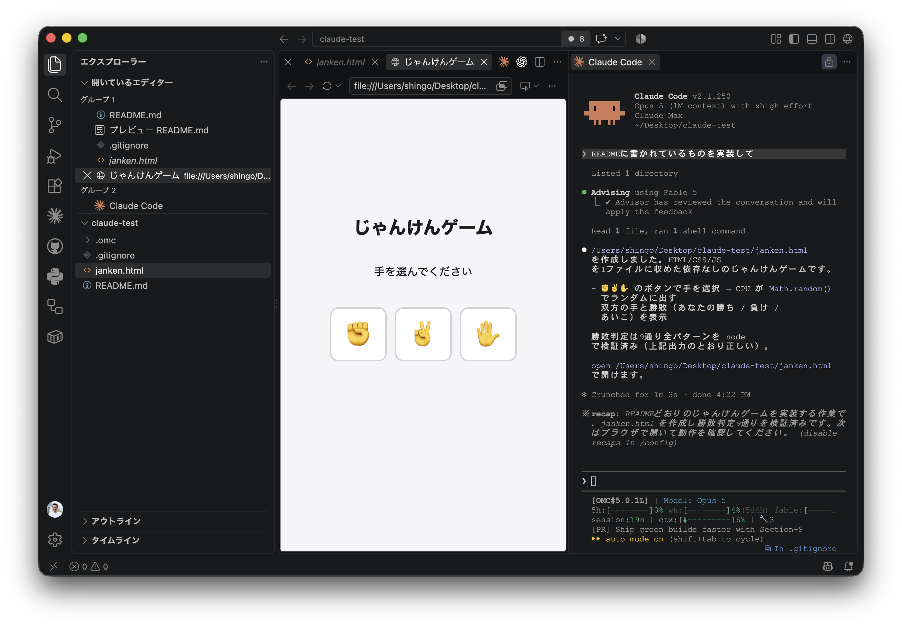

# 事前準備ガイド

事前準備のゴールは3点です。

- [ ] **Claude Codeが起動して、指示が通ること**
- [ ] **VS Code上でClaude Code拡張が使える状態であること**
- [ ] **`git` コマンドと `gh` コマンドが使える状態であること**

---

## 0. 必要なもの一覧

**当日つまずかないために、前半・後半で使うものを先に並べます。** 「必須」が揃っていれば本線は最後まで進めます。「任意」は無くても代替ルートがあるので、当日その場で判断して構いません。

### ソフトウェア・コマンド

**すべて必須です。** 全OS共通で揃えてください。

| 項目 | 確認方法 |
|---|---|
| **VS Code** | 起動する（→ 0.2） |
| **Claude Code拡張** | 一言送って応答が返る（→ 0.2） |
| **git** | Claude Codeに聞く（→ 0.2の6） |
| **`gh` コマンド（GitHub CLI）** | `gh auth status` が通る（→ 0.4） |
| **Node.js** | `node -v` でバージョンが出る（→ 0.2の4） |
| **ブラウザ** | ふだん使っているもので可 |

### アカウント

| 項目 | 必須/任意 | 備考 |
|---|---|---|
| **Claudeアカウント（Pro以上）** | **必須** | Max推奨（→ 0.1①） |
| **GitHubアカウント** | **必須** | 個人アカウント推奨（→ 0.1②） |
| **Googleアカウント（Gmail）** | **必須に近い** | 接続しない場合は見学で可（→ 0.1③） |
| **Cloudflareアカウント** | 任意 | Google認証で作成（→ 0.1④） |
| **Notionアカウント** | 任意 | 後半12はNotionかBacklogのどちらか片方でよい |
| **Backlogアカウント＋APIキー** | 任意 | **選ぶなら事前準備が必要**（下記） |

> **後半12でBacklogを選びたい人へ。** 当日この枠は15分しかなく、**アカウント作成とAPIキー発行をその場でやる時間はありません。** Backlogを使いたい人は、前日までに ①Backlogのスペースにログインできること ②「個人設定」→「API」からAPIキーを発行し、手元に控えてあること ③`node -v` が通ること——の3つを済ませておいてください。**どれか1つでも欠ける場合は、当日は`TASKS.md`中心に進めるか、Notion連携を選んでください。**

---

## 1. Claude準備

### ① Claudeのアカウントとプラン

1. [claude.ai](https://claude.ai) でアカウントを作成（既にあればログイン）
2. プランを確認します。**Claude Codeの利用にはPro以上が必須です。**（最新の料金は[公式の料金ページ](https://www.anthropic.com/pricing)で確認してください）
   - Max/Team/Entプランをご利用の方はそのままでOKです。
   - 会社のPC・アカウントで参加する場合は、社内ルールを確認のうえ必ず許可された状態で参加してください。
3. **プライバシー設定を開き、学習利用をOFFにしてください**（重要）
   - claude.ai の画面左下のアカウント名 →「設定」→ 左メニューの **「プライバシー」** を開く
   - **「AIモデルの改善にご協力ください」のトグルをOFF**にする（下の画像の位置です）
   - トグルが灰色（左寄り）ならOFFです。青色（右寄り）ならクリックして切り替えてください



> **なぜOFFにするのか**
> ONのままだと、チャットやコーディングセッションの内容がAnthropicのAIモデルの訓練・改善に使われます。
> 業務に近い題材を扱う方もいることが想定されるため、参加者は一律で**OFFの状態で参加**してください。

> **前日までに済ませてほしい理由**
> 当日別の作業ですでに使っていると、ハンズオン中に「上限に達しました」と表示されてそれ以上使えなくなることがあります。使用制限に達した場合はプランのアップグレードをしていただく必要があるため、余裕がある状態でご参加ください。

### ② GitHubアカウント

このワークショップでは、**教材リポジトリ**（このリポジトリ）は**ブラウザや画面共有で見るだけ**で使います。cloneは不要です。そのかわり当日、ハンズオン①・②でそれぞれ**新しいリポジトリを1つずつ、その場で作成**します（`vibecoding-0908`・`myapp`）。作成したリポジトリには、動作を確認できた状態を**15分ごとにGitHubへ保存（コミット＆プッシュ）**します。操作はすべてClaude Codeに頼むので、gitやGitHub CLIのコマンドを覚える必要はありません。

1. [github.com](https://github.com) で無料アカウントを作成（既にあればログイン）
2. 確認方法: ログインした状態で右上の「＋」→「New repository」を押し、**リポジトリ作成画面が開くこと**を確認
   - **ここでは作らなくて構いません。**「画面が開く＝準備OK」です
3. アカウント名（ユーザー名）を控えておいてください。チェックポイント0で提出します

> **当日作る `vibecoding-0908`・`myapp` は、それぞれのGitHubアカウントに新規作成する自分だけのリポジトリです。** 誰かと共有するテンプレートをforkするわけではないので、他の参加者と書き込みが衝突する心配はありません。
> 作成には **GitHub CLI（`gh` コマンド）** を使います。事前準備でやっておくのは、`gh` コマンドがログイン済みの状態にしておくことだけです（下の0.4）。

> 会社支給のGitHubアカウント（Organization所属）でも参加できますが、**個人アカウントを推奨**します。
> 組織のポリシーでPublicリポジトリの作成や一部機能の実行が禁止されている場合があり、当日そこで止まると進行の妨げになります。

### ③ Googleアカウント（Gmail）

前半2で、ClaudeをGmailと連携させる（MCPのコネクタ機能を試す）ハンズオンがあります。ふだん使っているGoogleアカウント（Gmail）にログインできる状態にしておいてください。新規に作る必要はありません。

> **個人のGmailをAIと連携させることに抵抗がある方へ**: 無理に接続しなくて構いません。当日は隣の人の画面を見学するだけでも、ハンズオンの目的（外部サービスとつなぐ体験をする）は達成できます。会社支給のGoogleアカウントは、組織のポリシーで接続が拒否されることがありますので避けてください。

### ④ Cloudflareアカウント（任意・当日でも可）

後半11で、作ったアプリを実際にインターネットへ公開します。**アカウント無しでも公開を試せる方法は用意している**ので、事前準備としては必須ではありません。

ただし、**公開したものを1時間以上残したい場合は無料アカウントが必要**です。当日その場でも作れますが、時間を節約したい人は先に作っておいてください（クレジットカード不要）。

**作り方は全員共通で、③で用意した個人のGoogleアカウントでの認証に統一します。**

1. [dash.cloudflare.com](https://dash.cloudflare.com) を開く
2. **「Sign in with Google」** を選ぶ
3. ③で使う個人のGoogleアカウントを選んで許可する

そのメールアドレスにCloudflareアカウントが無ければ、**その場で新規作成されます。** メールアドレスとパスワードを別途決める必要はありません。当日 `wrangler` でログインするときも同じ経路なので、パスワードを思い出せずに止まることがなくなります。

> **すでにCloudflareアカウントを持っている方は注意してください。** 既存アカウントをお使いの方は、**いつもの方法でログインしてください。**

> 会社のドメインをCloudflareで管理している方は、**業務用アカウントではなく個人アカウントを使ってください。** 当日の公開先を業務環境に混ぜないためです。会社支給のGoogleアカウントも、③と同じ理由で避けてください。

## 2. 開発環境のセットアップ

この講座ではVS Code上でClaude Codeを使い、リポジトリの取得や保存にはgitを使います。次の順にインストールしてください。

1. [VS Code](https://code.visualstudio.com/) をインストール（既にあればそのままでOK）
2. **VS Codeのバージョンを確認する。** メニューの「Code」→「バージョン情報」（Windowsは「ヘルプ」→「バージョン情報」）で確認し、**1.94.0 より古ければ先に更新してください**（「Code」→「更新の確認」）

   > **なぜ先に確認するのか。** Claude Code拡張には必要なVS Codeのバージョンがあります。**古いままだと、拡張を入れても起動しません。**

3. VS Codeの拡張機能から「Claude Code」を検索してインストール
4. **全OS共通**: [nodejs.org](https://nodejs.org/) から**LTS版（推奨版）**をダウンロードしてインストールし、**インストール後にPCを再起動**してください
   - LTS版はダウンロードページで最初に大きく表示されているボタンでOKです。インストーラーの選択肢はすべて既定値のままで進めて構いません
   - **Windowsでは、これが無いとClaude Code拡張がそもそも起動しません**（既知の制約です）。Mac／Linuxでは拡張の起動自体には不要ですが、**後半11の公開と後半12のBacklog連携で使う**ので、同じように入れておいてください
   - 入ったかどうかは、ターミナルで `node -v` を実行してバージョン番号（`v22.x.x` など）が出れば確認できます。すでに入っている人はそのままで構いません
5. VS Code内でClaude Code拡張を開き、案内に従ってClaudeアカウントでログイン
   - **Windowsで、ログインしても反応がない・起動しない場合**: まず2のVS Codeのバージョンを確認してください。1.94.0以上なら、4のNode.jsインストールが未完了か、PCの再起動がまだの可能性があります。再起動してから開き直してください
6. ログイン後、拡張内のターミナル（またはチャットパネル）で何か一言送り、応答が返ってくることを確認

```
こんにちは。動作確認です。
```

応答が返ってくれば、ここまでは完了です。



> **パネルが見当たらなくなったら**、VS Code左端の縦アイコン列（アクティビティバー）にあるClaudeのアイコンをクリックすると開き直せます。見つからない場合は `Cmd/Ctrl+Shift+P` でコマンドパレットを開き、「Claude Code」と入力して探してください。

> ターミナルの操作に慣れている方は、`npm install -g @anthropic-ai/claude-code` などでCLI版を直接使うこともできますが、**当日はVS Code拡張を使う前提で進行します。** まずはVS Code拡張での起動を優先してください。
>
> インストール方法は変わることがあります。うまくいかない場合は公式ドキュメント
> （[docs.claude.com/claude-code](https://docs.claude.com/en/docs/claude-code/overview)）の手順を正としてください。

> **（Windowsのみ）拡張がクラッシュして起動しない場合**: Windows版のClaude Code拡張は、特定バージョンで起動時にエラー（`TypeError`など）を出して使えなくなることがある既知の不具合があります。Node.jsを入れても直らない場合は、この不具合の可能性があります。
> 復旧手順: VS Codeのメニュー「表示」→「ターミナル」でターミナルを開き、`npm install -g @anthropic-ai/claude-code` を実行（4でNode.jsを入れていれば追加の準備は不要です）。インストール後、そのターミナルで `claude` と入力すればCLI版が起動します。**今日の内容はすべてCLI版でも同じように進められます。** 拡張のパネルの代わりに、このターミナルの `claude` を使ってください。

7. 続けて、いま開いているClaude Codeのパネルに次を送り、**gitが使える状態か確認してもらってください**（リポジトリ取得と、当日ずっと使う「作業の保存」の土台になります）

```text
このPCでgitコマンドが使える状態か確認してください。
使えない場合は、このOSに合ったインストール方法を教えてください。
可能であれば、インストールの手伝いもお願いします。
```

- 「使えます」と返ってきたら、完了です
- **Macの場合**: 初回は「"git"コマンドを実行するにはコマンドラインデベロッパツールが必要です。今すぐインストールしますか?」という画面が出ることがあります。そのまま「インストール」を押して待ってください（数分かかります。待っている間に次に進めても構いません）
- **Windowsの場合**: [git-scm.com](https://git-scm.com/download/win) からインストーラーをダウンロードして実行し、表示される選択肢はすべて既定値（Next連打）で進めてください
- インストール後も反応が変わらない場合は、**VS Codeを一度終了して開き直し**、同じ質問をもう一度送ってください（インストール直後はVS Code側が古い状態を覚えていることがあります）

> **なぜここでgitを確認するのか**: 当日ハンズオン中に「いまの状態を保存して」とお願いする場面、詰まったときの「いまの状態に戻す」——これらは**gitが使えることが前提**です。gitが無くても当日を乗り切る手段はありますが、使えることが確認できていた方が、当日できることの幅が大きく広がります。**このタイミングで解決しておくことを強くおすすめします。**

8. 続けて、**コミットに残る名前とメールアドレス**を確認します。次を送ってください。

```text
git config --get user.name と git config --get user.email を実行して、
結果をそのまま見せてください。まだ何も変更しないでください。
```

**何が表示されたかで、やることが変わります。**

| 表示 | やること |
|---|---|
| **何も出ない（空）** | 下の8へ。**設定しないと、当日の最初のコミットでエラーが出て止まります** |
| **心当たりのある名前とアドレス** | そのままで構いません。**ただし、そのアドレスが公開リポジトリの履歴に残ります**（当日 `vibecoding-0908` は公開で作ります）。それで困る場合は下の8へ |
| **会社のメールアドレス** | 下の8で個人用に変えることをおすすめします |

9. 名前とアドレスを設定します。**メールアドレスはGitHubが用意している「noreplyアドレス」を使います。**

   - GitHubで [Settings → Emails](https://github.com/settings/emails) を開く
   - 「Keep my email addresses private」にチェックを入れる
   - すぐ下に表示される `NNNNNN+ユーザー名@users.noreply.github.com` の形のアドレスを控える

   控えたら、Claude Codeに次を送ってください。丸括弧の中は自分の値に置き換えます。

```text
次の2つを実行して、設定後の値を見せてください。

git config --global user.name "(表示に使ってよい名前)"
git config --global user.email "(控えたnoreplyアドレス)"
```

> **なぜnoreplyアドレスなのか。** コミットに書いたメールアドレスは、**公開リポジトリでは誰でも見られます。** 一度pushすると履歴に残り、消すのは簡単ではありません。GitHubのnoreplyアドレスなら、**あなたのアカウントとは紐づくが、実際のメールアドレスは公開されません。**
>
> **名前のほうも、公開されて困らないものにしてください。** 本名である必要はありません。

> **アドレスを推測させないでください。** 「私のメールアドレスを設定して」のような頼み方をすると、Claudeが**それらしいアドレスを作ってしまう**ことがあります。**必ず自分で控えた値を貼ってください。**


## 3. 動作確認

セットアップ確認を兼ねて、最初のアプリを1本作ってみましょう。

1. デスクトップなどに、空のフォルダを1つ作る（名前は `claude-test` など何でも構いません）

2. VS Codeのメニューから「ファイル」→「フォルダーを開く…」で、そのフォルダを選ぶ

3. `claude-test` パネルを右クリック→「新しいファイル」→`README.md` と入力して以下を記入する

   ```text
   # じゃんけんゲーム
   - HTMLファイル1つで構成される簡単なブラウザゲーム
   - プレイヤーがグー・チョキ・パーのいずれかを選ぶと、コンピューターがランダムに手を出し、勝敗が表示されるじゃんけんゲームができる
   ```

4. Claude Codeのパネルを開き、次を貼り付けて送信する

   > フォルダへのアクセス権限を聞かれたら「Yes, I trust this folder」を選択

   ```text
   READMEに書かれているものを実装して
   ```

5. 実行中に「〜してもよいですか?」という確認（権限プロンプト）が出たら、内容を確認して「許可」してください
   - 今日の範囲では、表示された内容が「今いるフォルダの中のファイル操作」なら許可して構いません
   - 何を聞かれているか分からなかったら、そのまま当日質問してください（当日冒頭で解説します）
6. できあがったHTMLファイル（`janken.html` など）を開いて、じゃんけんが遊べることを確認
   - 開き方: VS Code左側のファイル一覧で `janken.html` を右クリック →「統合ブラウザーで開く」を選ぶと、VS Code内のブラウザーでその場で動作確認できます
   - メニューに出てこない場合は、右クリック →「Finderで表示」（Windowsは「エクスプローラーで表示」）→ 出てきたファイルをダブルクリックでもOKです
   - **開き方が分からなければ、Claude Codeにそのまま聞いてください。** 「作ったファイルをブラウザで開く方法を教えて」で答えてくれます



> ここで確認したいのは**環境が動くこと**だけです。当日の題材は別に用意してあるので、ここで完成度を気にする必要はありません。

## 4. GitHub CLI（gh）の準備

当日は、ハンズオン①でその場に `vibecoding-0908`、ハンズオン②で `myapp` という2つの個人リポジトリを作成します。**どちらも当日その場でClaude Codeに頼んで作るので、事前に作成しておく必要はありません。** 事前準備では、その土台になる **GitHub CLI（`gh` コマンド）** が使える状態にしておくだけで十分です。

Claude Codeのパネルを開き、次を貼り付けて送信してください。

```text
このPCでGitHub CLI（ghコマンド）が使える状態か確認してください。
使えない場合は、このOSに合ったインストール方法を教えてください。
可能であれば、インストールの手伝いもお願いします。
インストールできたら、gh auth login でGitHubにログインする手順も教えてください。
```

- 「使えます、ログイン済みです」（`gh auth status` を実行すると自分のユーザー名が表示される状態）になれば完了です
- ログインを求められたら、0.1②で作ったGitHubアカウントでログインしてください
- 権限プロンプトが出たら、内容を確認して許可してください

> **なぜここで `gh` コマンドを確認するのか**: 当日ハンズオン中に「新しいリポジトリを作ってGitHubにも作成して」とお願いする場面が2回（ハンズオン①・②）あります。これは `gh` コマンドが使えることが前提です。ここで解決しておくと、当日その場で足止めされずに済みます。

> **`gh` コマンドがどうしても使えなかった場合**: 当日は代わりに、ブラウザのGitHub画面（右上の「+」→「New repository」）でリポジトリを手動作成し、表示されたURLをClaude Codeに渡して `git clone` してもらう手順に切り替えられます（`git` さえ使えれば問題ありません）。前日までに `gh` コマンドが直らなくても、当日の進行に支障はありません。

当日は、`vibecoding-0908`・`myapp` のどちらも、ホームフォルダの下の `github` フォルダ（`~/github/`。Windowsでは `C:\Users\⟨自分の名前⟩\github\`）にまとめて作ります。**この事前準備の段階では、まだフォルダを作る必要はありません。** 当日Claude Codeが自動で作ります。普段使っているリポジトリの置き場所がすでにある人は、当日そちらに作ってもらっても構いません。

教材リポジトリ（このリポジトリ）は当日ブラウザや画面共有で見るだけですが、参考までに中身の要点です:

| フォルダ | 中身 | いつ使うか |
|---|---|---|
| `docs/` | 当日のテキスト（前半・後半） | 当日ずっと |
| `templates/` | コピペして使うテンプレート | 前半4、宿題、後半 |
| `starters/` | 前半2の代替お題テンプレート3種＋救済版（完成状態） | お題に迷ったとき／詰まったとき |
| `skills/` | Skillの**完成例7枚**（前半3枚は答え合わせ用／後半4枚はコピーして使う） | 詰まったとき／後半9・10 |

> `templates/` のファイルや救済版が必要になったときは、教材リポジトリのGitHubページから直接開く、またはClaude Codeに「このURLの中身を教えて」と頼んで参照できます。具体的な使い方は [starters/README.md](../starters/README.md) にまとめてあります。

> **`skills/` は今は開かないでください。** 前半4〜5では、まず自分の言葉でSkillを書くのが本題です。答えを先に見ると、その体験が薄くなってしまいます。

**✅ 自己確認**: 「使えます」という返答と、`gh auth status` であなたのユーザー名が表示されることを確認できれば完了です。提出は不要です。

## 5. つまずき早見表

| 症状 | 対処 |
|---|---|
| Claude Codeのログインでブラウザが開かない | 表示されたURLを手動でブラウザに貼り付ける |
| VS Code拡張が認証を通らない | 一度VS Codeを再起動してから再試行。それでもだめなら公式ドキュメントの手順を確認 |
| Claude Code拡張が起動しない・反応しない | まず0.2の2でVS Codeのバージョンを確認（1.94.0以上か）。**Windowsの場合は**あわせて0.2の4でNode.js（LTS版）をインストールし、PCを再起動してから開き直してください |
| （Windows）拡張がエラー（TypeErrorなど）を出してクラッシュする | 既知の不具合の可能性があります。0.2の「拡張がクラッシュして起動しない場合」の手順でCLI版に切り替えてください |
| 権限プロンプトで固まった | 内容を読んで「許可」。判断に迷うものは前日ならスキップし当日質問でOK |
| 「上限に達しました」と出た | **前日なら**5時間待てば回復するので問題ありません。**当日出た場合は待てません**——挙手したうえで、プランを上げてください。当日出さないために0.1の注意を守ってください |
| GitHubの「New repository」画面が開かない・作成が禁止されている | 組織アカウントのポリシー制限の可能性。**個人アカウントを別途作成**してください（無料）。当日 `gh repo create` も同じ理由で失敗します |
| GitHubに2要素認証（2FA）を求められた | 設定を完了させておいてください。当日その場でやると5〜10分持っていかれます |
| コミットで `Author identity unknown` と出た | 0.2の8〜9をやっていない状態です。名前とメールアドレスを設定してください |
| gitのインストールで詰まった（Windowsでインストーラーが進まない・管理者権限がないなど） | まずClaude Codeに状況をそのまま伝えて相談してください |
| `gh` コマンドが使えない・`gh auth login` が通らない | まずClaude Codeに状況をそのまま伝えて相談してください。ブラウザでの認証画面が開かない場合は、表示されたURLを手動でブラウザに貼り付けてください |
| `gh repo create` や `git clone` でエラーが出る | エラーメッセージをそのままClaude Codeに貼って「直してください」と頼んでください。GitHubログイン未完了や `gh auth status` が通っていないことが多い原因です |
| 会社PCでプロキシに阻まれる | 個人PCでの参加を推奨。難しければ事前に主催者へ連絡 |

## 6. 余裕がある人向けの予習

やらなくても当日は困りません。やっておくと前半・後半のペースに余裕が出ます。

- **全員向け**: [columns.md](columns.md) の **★5 スキル** を先読みする。前半4で「自分の作法をファイルにして保存する」ことをやります。ここだけ概念が新しいので、先に1本読んでおくと当日の理解が速いです
- **全員向け**: 講師によるデモ動画（URLは案内メールに記載）があれば観る
- **起業家・非エンジニアの方向け**: 0.3のじゃんけんゲームに、追加で1回だけ「見た目をもっと楽しく」と指示してみてください。当日の本線「見て、直す」の30秒予習になります

## ✅ チェックポイント

次が終わっていることを確認してください。

- [ ] じゃんけんゲームが動いた
- [ ] **GitHubのユーザー名**（当日のサポートで使います）
- [ ] **`gh auth status` が成功し、自分のユーザー名が表示された**（スクリーンショットでも可）
- [ ] **`git config --get user.email` が、公開されて困らないアドレスを返す**（GitHubのnoreplyアドレス推奨）

提出をもって事前準備完了です。動かなかった場合もスクリーンショット＋状況を送ってください。当日開始前のサポートタイムで優先対応します。
