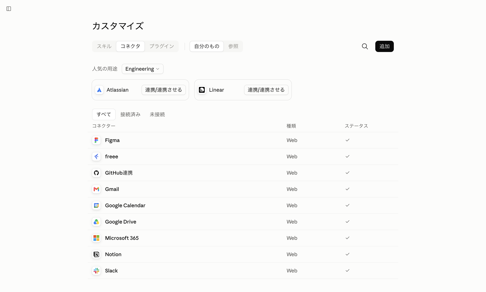

# 前半: Vibe Codingをはじめよう

前半のゴール: **Claude Codeを使いこなす基礎を身につけ、自分が作りたいものをAIと一緒に具体化できるようになること。**

そのために、「頼んだら本当にソフトウェアができた」という体験をし、そこから「自分は何を作りたいのか」を言葉にし、その言葉にする作法自体をSkillとして保存します。

## やること

| 時間（案） | やること | この枠の成果物 |
|---|---|---|
| 0:00–0:10 | **1. オープニング** — バイブコーディングとは／今日の全体地図／最初に叩く6つのコマンド | — |
| 0:10–1:00 | **2. ハンズオン① Claude Codeを触る** — 実践用リポジトリで簡単なものを1個作る。権限プロンプトと設定の確認、MCPでGmailとつなぐ体験まで | 動くアプリ1個以上・Gmail下書き1通 |
| 1:00–1:30 | **3. ハンズオン② 自分が作りたいものを考える** — 何を／誰が／何ができればいいか／どんな体験にしたいかを言語化する | Intentを書いたREADME |
| 1:30–1:45 | **休憩** | — |
| 1:45–2:35 | **4. ハンズオン③ Grill Me系Agent Skillを自作する** — 曖昧なアイデアを徹底的に質問して明確化するSkillを、tsumete・ddd・tsumetsumeの3つに分けて自分で作る | `SKILL.md` 3ファイル |
| 2:35–2:55 | **5. ハンズオン④ SkillとHooksで開発工程を拡張する** — Skillで工程を拡張する考え方と、条件に合えば確実に処理を実行するHooksの両方に触れる | 候補SkillのメモとHook 1件 |
| 2:55–3:00 | **6. 前半まとめ・宿題の説明** | — |

時間は目安です。**3〜4が前半の核心**なので、2が長引いたときはここを削らず、2を切り上げて先へ進んでください。**2はMCPハンズオンを含むため50分、4は3つのSkillを作るため50分と長めです。** 押しても2・4は削らず、5（Security Review Skillの紹介部分）を切り上げてください。

---

## 1. オープニング

### バイブコーディングとは

コードを書く代わりに、**「こうしたい」を言葉で伝え、動くものを見て、また言葉で直す**開発のやり方です。設計書も仕様書も、最初は書きません。今日の前半でやることは3つだけです。

1. 作りたいものを伝える
2. 動いたものを**見て確認する**
3. 感じた間違い・違和感を指摘する

「コードが読めないのに大丈夫？」— 大丈夫です。判断はすべて**画面確認**して決めます。コードを読んで判断する場面はありません。

### 今日の予定

冒頭の「やること」をひととおり説明します。**今日は「自分のアイデアをソフトウェアとして実装する土台づくり」**です。**この前半さえ乗り切れば後半はひたすらやるだけ**状態にできます。

### Claude Codeはどう動いているのか？

- Claude Codeはコーディングに特化したエージェントハーネスです。
- エージェンティックループし続けながら、人間と対話を繰り返し、都度指示にあった応答・ツール利用を繰り返すことで、人間との協業を実現します。

#### ツール
モデル自体にドキュメントやソースコードを編集する能力はありません。Claude Codeというハーネスには、モデルが応答した「人間の指示内容からすると、このツールを使ってこういうことをすればよい」という内容に応じて、実際にBashなどのコマンドツールを動かしてファイルを編集することで、チャットでやりとりする以上に、実世界に作用することができます。

### 基本的なスラッシュコマンド

Claude Codeの入力欄で `/` から始まる**スラッシュコマンド**を打つと、設定の確認や変更ができます。手を動かし始める前に、6つだけ実際に確認しておきます。

#### ① `/help` — 何が使えるかを一覧する

```text
/help
```

Claude Codeに**インストールされているコマンドの一覧**が出ます。**このあと出てくるコマンドを忘れても、ここから探せます。**

並ぶのは組み込みのものだけではありません。**あとから入れたAgent Skillや、自分で書いたカスタムコマンドも、カスタムコマンドの一覧に表示されます。** ハンズオン③で自作するGrill系スキルも、保存して会話を切り直せば `/tsumete` のようにここへ並びます。

> 入力欄で `/` を1文字打つだけでも、同じ候補が絞り込み付きで出ます。名前をうろ覚えのときはこちらが速いです。

#### ② `/status` — いまの状態を確認する

```text
/status
```

バージョン・**いま使っているモデル**・ログイン中のアカウント・接続中のMCPサーバーなどがまとめて表示されます。

#### ③ `/model` — 使うモデルを選ぶ

```text
/model
```

一覧が出るので矢印キーで選んでEnter。モデルは**頭脳の賢さ**だと思ってください。
Claudeのモデルは複数ありますが、賢さ（パラメータ数）は **Fable > Opus > Sonnet > Haiku** の順番になっています。

> **この画面では左右キーでeffort（考える深さ）も一緒に切り替えられます。** 上下キーでモデルを選び、左右キーでそのモデルのeffortを変え、Enterで確定します。

- **これからやる前半は、SonnetやHaikuで十分です。** 応答が速い＝直す回数を稼げる＝バイブコーディングが気持ちよく回る。利用枠の消費も少なくて済みます
- 宿題でアイデアを詰めるときや、難しいバグに詰まったときは、賢いモデルに切り替える価値があります

#### コンテキスト

モデル自体は1問1答で、以前やりとりした内容を覚えておく機能がありません。そのため、Claudeには人間とClaudeがやりとりしているセッション中の、チャット内容、編集対象のファイル内容、コマンドの出力結果などを記憶しておき、毎回のやりとりに以前のやりとりを付加して毎回モデルに送信しています。それらのセッションごとの記憶をしておく領域をコンテキストウィンドウと呼びます。これにより、毎回さも前回のやりとりをモデルが覚えているかのようにやりとりができるのです。

モデルごとに最大のコンテキストウィンドウが決まっており、Anthropicが提供するデフォルトではFable/Opus/Sonnetは1M(M=100万)、Haikuは200K(K=1,000)です。


#### ④ `/effort` — 考える深さを選ぶ（任意）

```text
/effort
```

`low` / `medium` / `high` / `xhigh` / `max` から選びます。同じモデルでも、**答える前にどれだけ考えるか**が変わります。前半は `low` か `medium` で十分です。

ちなみに③の `/model` 画面でも左右キーで設定できますが、このコマンドを使うとeffortだけを直接指定できます。

この思考の深さの違い自体に価格の違いはありません。ただしより深い思考は、その分より多くトークン消費する可能性があることにくわえ、応答速度が遅くなる傾向があります。

#### ⑤ `/usage` — 利用枠の残量を確認する

```text
/usage
```
**5時間ごとの枠**と**週ごとの枠**、それぞれの残量が表示されます。

今日はこのあとハンズオンや宿題で数時間はClaude Codeを使い続けます。途中で不安になったら、いつでもこのコマンドで確認してください。**足りなくなったらプランのアップグレードを検討してください**

#### ⑥ `/permissions` — 許可の仕組みを見る

```text
/permissions
```

Claude Codeは、ファイルを書き換えたりコマンドを実行したりする**ツールを使うたび**に、「実行してもよいですか?」と確認を挟みます。これが安全装置の本体です。一度許可した内容はルールとしてここに溜まっていき、あとから一覧で確認・取り消しができます。

#### 権限

この「毎回確認する/しない」の挙動を切り替えるのが **Permission mode** です。4つあります。

| モード | 挙動 |
|---|---|
| **default（手動・既定値）** | ツールを使うたびに確認する。**今日はこのままにしてください** |
| **acceptEdits（自動・編集のみ）** | ファイル編集は自動で承認し、コマンド実行など編集以外は確認する |
| **bypassPermissions（自動・全許可）** | すべて確認なしで実行する。速いが、**被害が小さい操作のときだけ**にとどめる |
| **plan（プランモード）** | 何も変更せず、**まず計画だけ**を提示する。確認して進めるかを判断してから実行に移る |

切り替えは `/config` の Permission mode、または入力欄で **Shift+Tab を2回**押すとプランモードに入れます。**今日は default のままで進めてください。** 自動化の度合いを上げるほど便利になりますが、間違えたときの被害範囲も広がります。仕事のリポジトリで使うときは、ここの設計から入ってください。

#### 変えたら、もう一度確認する

```text
/status
```

## 2. ハンズオン① Claude Code基礎

### やること

| 目安 | やること |
|---|---|
| **17分** | 作る → 見る → まとめて直す（下の「やること」1〜5） |
| **20分** | [MCPでGmailとつなげてみる](#mcpでgmailとつなげてみる20分) |
| **8分** | [設定を開いて中を見る](#設定を開いて中を見る)（`/permissions`・`/config`） |
| **5分** | 予備 |

**生成を待っている時間は、下の「途中で『許可しますか?』と聞かれる」を読む時間に使ってください。** 待ちは必ず発生します。そこを読書に充てると、この50分が実質的に伸びます。

### やること

**ハンズオン実践用リポジトリ**をClaude Codeで開き、簡単なものを1つ、Vibe Codingで作ります。ここではあえて**仕様を厳密にしすぎません**。「こういうものが欲しい」を思いつくまま伝え、出てきたものを見て、直したいところを言葉で返す——このリズムを体で覚えるのが目的です。

1. **実践用リポジトリのフォルダをVS Codeで開く** — メニューの「ファイル」→「フォルダーを開く…」から、事前準備0.4で取得した実践用リポジトリのフォルダを選びます
2. **今日の作業用フォルダを作る** — 自分でフォルダを掘らず、Claude Codeに頼んでしまうのが速いです。`0901-yamada` は「日付＋自分の名前」に置き換えてください（20人分のフォルダが混ざらないようにするためです）

   ```text
   このフォルダの中に「0901-yamada」という名前のフォルダを作って、
   これからの作業はその中でやってください。
   ```

3. 下の「お題の例」から1つ選ぶか、自分で思いついたものをそのまま指示する
4. **できあがったものをブラウザで開いて動かす** — VS Code左側のファイル一覧でHTMLファイルを右クリックし、「Finderで表示」（Windowsは「エクスプローラーで表示」）→ 出てきたファイルをダブルクリック
5. 気になったところ（見た目・動き・言葉づかいなど）を**2〜3個まとめて1回**で伝えて直させる

> **どこで詰まっても、まずClaude Codeに聞いてください。** 「作ったファイルをブラウザで開く方法を教えて」でも答えてくれます。今日は**手順が分からないこと自体をAIに聞ける**のが前提の環境です。

### お題の例

迷ったら、そのままコピペしてください。自分のやりたいことがあれば、それを優先して構いません。

```text
ブラウザで遊べるテトリスを、1つのHTMLファイルで作ってください。
矢印キーの左右で移動、上キーで回転、下キーで落下を速められ、
横一列そろったら消えてスコアが増え、ブロックが天井まで積み上がったらゲームオーバー、
という基本のルールで動くようにしてください。
```

もう少し手順のある題材で試したい場合は、[starters/](../starters/) にある3種のお題（ポモドーロタイマー・診断チャート・習慣トラッカー）も使えます。使い方は [starters/README.md](../starters/README.md) を参照してください。

### 途中で「許可しますか?」と聞かれる

指示を出すと、Claudeがコマンドを実行する直前・ファイルを触る直前で必ず一度止まり、こういう確認が出ます。

```text
Bash command

  mkdir -p tetris
  作業用のフォルダを作成します

Do you want to proceed?
❯ 1. Yes
  2. Yes, and don't ask again for mkdir commands in /Users/you/handson
  3. No, and tell Claude what to do differently (esc)
```

これはClaude Codeの**安全装置**です。ファイルの作成・変更やコマンドの実行は、必ずあなたの許可を取ってから行われます。

> **見た目は環境で少し変わります。** ターミナルでは上のような番号付きのリストで出て、矢印キー＋Enter（または数字キー）で選びます。VS Code拡張ではボタンとして出ることがあります。**並んでいる選択肢の中身は同じ**なので、下の表で読み替えてください。

| 選択肢 | 意味 | 今日どう使うか |
|---|---|---|
| **1. Yes** | 今回だけ許可する | 迷ったらこれ |
| **2. Yes, and don't ask again for ...** | **同じ種類の操作を、以後は聞かずに実行してよい**と記憶させる | 同じ確認が何度も出て煩わしくなったらこれ。記憶される範囲は、その行に表示されているフォルダの中だけ |
| **3. No, and tell Claude ...** | 断って、代わりにどうしてほしいかを伝える。選ぶと入力欄に戻るので、そこに希望を書きます | やろうとしていることが違うと思ったとき。Escキーでも同じ |

見出しは操作の種類で変わります。`Bash command` ＝コマンド実行、`Create file` ＝ファイル作成、`Edit file` ＝ファイル変更。ファイルを作る・変えるときは、2番が `Yes, for this session`（このセッションの間は聞かない）になります。

**今日の範囲では、表示された内容が「今いるフォルダの中のファイル操作」なら 1 か 2 を選んで構いません。**

> **ポイントは2番が「記憶される」ことです。** 最初の数回は1番で中身を読み、同じ確認が3回目に出たら2番に切り替える——これが今日いちばん時間を節約する使い方です。読まずに2番を連打するのだけは避けてください。何を許可したかは、あとで `/permissions` から確認・取り消しができます。

### まとめて1回で直させる

出てきたものを触ると、必ず「思ってたのと違う」が出ます。それを1個ずつ言うのではなく、**2〜3個まとめて1回**の指示にします。

```text
3点直してください。
1. 落ちるスピードが速すぎるので、もう少しゆっくりに
2. 次に来るブロックが分かるように、プレビューを表示して
3. 全体の色合いをもう少し明るく
```

> **なぜ1つずつ言わないのか**
> 違和感を1個ずつ投げると、やりとりの回数が増えて時間を消耗するうえ、全体の方向性が伝わらず「直したら別の場所が変になる」が起きやすくなります。**2〜3個まとめて1回**が、速くて、仕上がりも良い作法です。今日はこのリズムで回します。

### 詰まったら: リカバリー3手

高確率でどこかで「動かなくなった」「思わぬ方向に壊れた」が起きます。そのときの手順です。

| 手 | いつ使う | どうやる |
|---|---|---|
| **① エラーをそのまま貼る** | 画面が真っ白・エラーが出た | エラーメッセージや画面のスクショを**説明せずそのまま**貼り、「動かなくなりました。直してください」 |
| **② ひとつ戻す** | 直る気配がない・どんどん悪化する | 「さっきの変更を取り消して、直前の動いていた状態に戻してください」 |
| **③ 小さく言い直す** | 欲張った指示が空中分解した | 一度に5個頼んだなら「まず1個だけ」に分割してやり直す |

> 覚え方: **貼る・戻す・小さくする。** 詰まりの9割はこの3手で抜けられます。

3手を2回試しても抜けられないときは、次の2つを試してから挙手してください。

- **モデルを賢くする** — `/model` で賢いモデルに切り替え、同じことをもう一度頼む。軽いモデルで的外れな答えが続くときはこれで通ることがあります
- **利用枠を確認する** — `/usage`。上限に達していたら手を動かしても進みません。**挙手してください。**メンター機で一緒に進めます（5時間ごとに回復もします）

### MCPでGmailとつなげてみる（20分）

ここまではファイルの中だけで完結する作業でした。Claude Codeは、**MCP（Model Context Protocol）**という仕組みを使うと、Gmail・カレンダー・社内ツールのような**外部のサービスとも直接やりとりできます。** MCPで何につなぐかは人によって全く違うので、今日は**ほぼ全員が持っているGmail**を共通のお題にします。

つなぐ作業はClaude Codeの外、**claude.aiの画面**で行います。

1. ブラウザで [claude.ai](https://claude.ai) を開く
2. 左側メニューの「**カスタマイズ**」→「**コネクタ**」を開く（`claude.ai/customize/connectors`）
3. 一覧から **Gmail** を探し、「**接続/連携させる**」を押す
4. Googleアカウントでログインし、表示された許可画面で内容を確認して許可する



> **個人のGmailアカウントを使うことに抵抗がある人は、無理に接続しなくて構いません。** 隣の人の画面を覗く、またはメンターの画面共有デモを見るだけでもこの20分の目的は達成できます。会社支給のアカウントでは接続が組織のポリシーで禁止されている場合もあります。

### 動かしてみる

接続できたら、**Claude Codeに戻って新しい会話を始めてください**（`/clear`、または一度終了して開き直す）。**MCPの接続も、SkillやHooksと同じく新しい会話から読み込まれます。**

```text
自分宛てに、件名「Claude Codeワークショップ」、
本文に今日ここまで作ったものを1行書いた下書きメールを作成してください。
下書きの作成だけをお願いします。送信はしないでください。
```

初めてGmailの操作をするときは、**いつもの「実行してもよいですか?」という確認**が出るはずです。今日の範囲（下書きを1通作るだけ）なら許可して構いません。実行できたら、実際にGmailの「下書き」フォルダを開いて、**指示した内容が本当に反映されているか**を自分の目で確認してください。

> **送信は必ず自分の意思で。** Claude Codeに「送信して」と頼めば送信もできてしまいますが、今日は下書き止まりにしてください。ファイルの操作と違って、メールは一度送ると取り消せません。

### 設定を開いて中を見る

ひととおり動かしたところで、**さっきの許可がどう溜まっているか**と、**変えられる設定の全体**を見ておきます。**アプリがまだ完成していなくても、ここは必ずやってください**（このあと②以降でずっと効いてきます）。ここが今日いちばん「Claude Codeという道具の形」が分かる場面です。

#### ① `/permissions` — 許可したことの一覧

```text
/permissions
```

さっき「2番」を選ぶたびに、ここへルールが1行ずつ追加されています。**自分が何を許可したのかをあとから一覧で確認でき、取り消せる**——これが安全装置のもう半分です。身に覚えのないものがあれば、ここで消しておいてください。

#### ② `/config` — 設定を開く

```text
/config
```

設定パネルが開きます。今日関係があるのはこのあたりです。矢印キーで項目を移動し、中身を眺めてみてください。

| 項目 | 何が変わるか |
|---|---|
| **Model** | オープニングで選んだモデル。ここからでも変えられます |
| **Permission mode** | 許可の求め方。**今日はデフォルトのまま**にしてください |
| **Theme** | 画面の配色。目が疲れる人はここで変える |
| **Editor mode** | 入力欄のキー操作（Vimキーバインドなど） |
| **Notifications** | 生成が終わったときの通知 |
| **Auto-update channel** | 本体の更新の受け取り方 |

> **Permission modeだけは今日触りません。** 許可を省略するモードもありますが、**省略していいのは「間違えても被害が小さい操作」だけ**です。今日は自分のフォルダの中で1ファイルのアプリを作るだけなので、デフォルトのままで不便はありません。仕事のリポジトリで使うときは、ここの設計から入ってください。

#### ③ `/context` — 会話がどれだけ溜まったか見る

```text
/context
```

いまの会話がどれだけの量になっているかが表示されます。会話は長く続けるほど毎回の消費が増えます。**話題が変わるときに会話を切る**のが、利用枠のいちばん確実な節約です。

#### ④ `/clear` — 会話を切って次へ

```text
/clear
```

いまの会話を終えて、まっさらな状態から始めます。**次のハンズオン②はまったく別の話題（自分のアイデアの壁打ち）です。ここで一度 `/clear` してから進んでください。** さっきまでの話が残ったままだと、そこを前提にした質問をされて噛み合いません。

> **消えるのは会話だけで、作ったファイルは消えません。** さっき作ったアプリはフォルダにそのまま残ります。安心して切ってください。

### ✅ チェックポイント1

- [ ] 実践用リポジトリの中に、自分で動かしたアプリが1つ以上ある
- [ ] 少なくとも1回は、まとめ指示で直した
- [ ] `/permissions` と `/config` を一度開いて、中を見た
- [ ] `/clear` で会話を切って、ハンズオン②に進める状態にした

### 🚀 拡張ミッション①（早く終わった人向け・任意）

> 拡張ミッションは全ハンズオン共通のルールです: **本線が終わった人だけ**が挑戦する。〔共通〕は誰でも、〔Eng〕はプログラミング経験者向け。やらなくても後半に一切影響しません。

- 〔共通〕**もう1個作る**: まったく別のお題で、同じリズム（頼む → 見る → まとめて直す）をもう一周する。2回目は必ず速くなります
- 〔共通〕**画像で直す**: 参考にしたいアプリやサイトのスクリーンショットを貼り、「この雰囲気に寄せて」と指示する。言葉にしにくい違和感が画像1枚で伝わる体験
- 〔Eng〕**差分を読む**: `git diff` で、まとめ指示1回でClaudeが何ファイルをどう触ったかを眺めてみる。後半のレビューで効いてくる感覚です

## 3. ハンズオン② 自分が作りたいものを考える（30分）

ここからが前半の本題です。**さっきまでは「ノリで動かす」体験でした。次は「何を作りたいのか」を自分の中から引き出す番です。**

### 壁打ちのやり方

Claude Codeとの**チャットのやりとり**で、自分の考えを整理します。いきなり実装させず、まず言葉にすることに集中してください。次のような一言から始めるとやりやすいです。

```text
これから何かソフトウェアを作りたいと思っています。
まだアイデアが固まっていないので、質問しながら一緒に考えてください。
最近困っていること・面倒だと感じていること・欲しいと思っていた機能があれば教えてください、
というところから聞いてみてください。
```

Claudeからの質問に答えながら、次の4点が言葉にできるところまで進めます。

1. **何を作りたいのか**
2. **誰が使うのか**
3. **何ができればいいのか**
4. **どんな体験にしたいのか**

まだぼんやりしていても構いません。むしろ、アイデアの形になっていない不満や繰り返している手作業のほうが良い種になります。**アイデアが1つも思い浮かばない人は、そのままメンターに声をかけてください。**

### READMEに書き出す

4点が言葉になったら、`README.md` として書き出します。書き込み用のワークシートは [templates/idea-readme.md](../templates/idea-readme.md) にあります。

**まず、自分のアプリの置き場所を決めます。** ここが**宿題も後半も、最後までずっと使うフォルダ**になります。前半2の試作フォルダとは別に、新しく作ってください。

```text
実践用リポジトリの中に「0901-yamada-app」という名前のフォルダを作って、
これから私のアプリの作業はすべてその中でやってください。
```

（`0901-yamada` の部分は、前半2と同じ「日付＋自分の名前」に置き換えてください）

```
⟨forkした実践用リポジトリ⟩/
├── 0901-yamada/          前半2の試作（使い捨て）
└── 0901-yamada-app/      ← ここが自分のアプリの家。今日から最後までここ
    └── README.md         ← いま作る
```

**このフォルダを覚えておいてください。宿題も後半も、ここを開いて始めます。**

```text
ここまで話した内容を、README.mdとしてまとめてください。
- 何を作りたいか（一言で）
- 誰が使うか
- 何ができればいいか（3〜5個程度）
- どんな体験にしたいか
```

これが、**頭の中のアイデア → AIとの対話 → 明文化されたIntent**というプロセスの最初の成果物です。宿題ではこのREADMEを、自作するGrill Me Skillでさらに深く問い詰めて仕様に育てます。

### ✅ チェックポイント2

自分のアイデアが書かれたREADMEが1つある状態。完璧である必要はありません。

## 休憩（15分）

ここまでで前半のちょうど半分です。**次のハンズオン③が今日いちばん長い50分の作業になる**ので、席を立って一度リセットしてください。PCはそのままで構いません。

## 4. ハンズオン③ Grill Me系Agent Skillを自作する（50分）

前半の核心です。**既存のSkillを使わせるのではなく、自分でSkillを作ります。**

### Skillとは何か

**やり方そのものをファイルに保存し、Claudeが必要なときに自分で読み込む**仕組みです。プロンプトを毎回書くのではなく、「いつ・何をするか」を1つのファイルにまとめておくと、以後は一言でその作法を呼び出せます。

### 3つに分けて作る

ここで作るのは、**ユーザーの曖昧なアイデアに対してAIが徹底的に質問し、作りたいものを明確化する**仕組みです。ジャンルとして「Grill Me系」と呼びます。1つの巨大なSKILL.mdに全部書くのではなく、**役割ごとに3つの小さなSkillへ分け、入口が組み合わせて使う**という形で作ります。

| Skill | 役割 | 呼び出し方 |
|---|---|---|
| `tsumetsume` | 一問ずつ問い詰める（グリルの本体） | 「詰め詰め」「詰める」 |
| `ddd` | 決まった用語・決定を`CONTEXT.md`・ADRに書き残す | 他のSkillから読み込まれて使われる |
| `tsumete` | 上の2つを組み合わせて実行する入口 | 「詰めて」 |

**小さな役割に分けて、入口(Skill)が他のSkillを呼び出しながら組み合わせる**——これもSkill設計の基本形です。名前は自分で決めて構いません。書き出しの雛形は [templates/grill-me-skill-template.md](../templates/grill-me-skill-template.md) にあります。

### ① `tsumetsume` を作る: 一問ずつ問い詰める

まずグリルの本体です。以下は一つの完成例です。

```markdown
---
name: tsumetsume
description: 計画や仕様を実装前に徹底的に問い詰めて磨き上げる。「詰め詰め」「詰める」と頼まれたときに使う。
---

# 詰め詰め

この計画のあらゆる側面について、共通理解に到達するまで徹底的にインタビューしてください。
質問は一度に一つだけにし、回答を受け取ってから次へ進んでください。
各質問には、あなたが推奨する回答も必ず添えてください。
調べれば分かる**事実**は質問せず自分で確認し、**決定**はユーザーに委ねてください。
```

冒頭の `description` が肝心です。Claudeはここを読んで「今このSkillを使うべきか」を判断します。**いつ使うかが書かれていないSkillは、置いてあっても呼ばれません。**

自分の言葉で、このSkillを書いてみてください。「何を聞くか」「どんな順番で聞くか」「どこまで厳しく詰めるか」は自由です。

> **答え合わせ用の完成例が [skills/tsumetsume/SKILL.md](../skills/tsumetsume/SKILL.md) にあります。** ただし**まずは見ないで書いてください。** 自分の言葉で書いたものでないと、宿題で自分が欲しい質問をしてくれません。詰まったとき、または書き終えてから開いてください。

### ② `ddd` を作る: 決まったことを書き残す

問い詰めていくと、その場その場で「決まったこと」が生まれます。それを会話の中に置き去りにせず、ファイルに書き残すSkillです。今回は最小版を作ります。

```markdown
---
name: ddd
description: 決まった用語をCONTEXT.mdに、後戻りしにくい決定をADR（決定記録）として書き残す。他のSkillから使われる。
---

# 決まったことを書き残す

会話の中で用語の意味が確定したら、そのつど CONTEXT.md に書き足してください。
あとから変更するのが大変な決定が出たら、docs/adr/ に短い決定記録（ADR）として残してください。
まとめて後回しにせず、決まった瞬間に書くこと。ファイルが無ければ作ってください。
```

`CONTEXT.md`＝プロジェクトの用語集、`ADR`＝あとで「なぜこうしたのか」を思い出すための短い決定メモ、と思ってください。**このSkillは自分単体では呼ばれず、次に作る `tsumete` から使われます。** 本格的な書式・使い分けの基準は、答え合わせ用の完成例 [skills/ddd/SKILL.md](../skills/ddd/SKILL.md) にあります（今日はここまで作り込まなくて構いません）。

### ③ `tsumete` を作る: 2つを組み合わせる入口

最後に、上の2つを束ねる入口です。中身は短くて構いません。

```markdown
---
name: tsumete
description: 計画を問い詰めて共通理解に到達させ、決まったことをその場で書き残す。「詰めて」と頼まれたときに使う。
---

# 詰めて

`tsumetsume` の進め方で一問ずつ問い詰めながら、`ddd` の進め方も併用してください。
確定した用語や決定は、質問を続けながらその場で書き残していきます。

最後に、次の2つを書き出してください。
- 仕様を README.md に（何を作るか／誰が使うか／できること／今回やらないこと／完成判定）
- 実装する順の「やること」を TASKS.md に。1つは15分以内で終わる大きさにし、
  それぞれ「画面のどこを見れば終わったと分かるか」を書く。
  上から順にやれば、途中で止まっても動くものが残る順番にする
```

`tsumetsume` ・`ddd` という名前の部分は、**自分がつけたSkill名に合わせて書き換えてください。**

> **最後の3行が、宿題の持ち物を決めます。** これを書かなければ、詰めた結果は会話の中に消えて、残るのは「話した記憶」だけです。書けば、宿題明けに**仕様と作業手順が手元にある**状態で後半に来られます。**入口のSkillに数行足すだけで、出てくる成果物が変わる**——これが今日いちばん持ち帰ってほしい感覚です。

### 保存もClaude Codeに頼む

Skillの置き場所（`~/.claude/skills/`）は、普段は見えない場所にあります。**自分でフォルダを掘る必要はありません。** 3つまとめて、Claude Codeに保存させてください（前半2で覚えた「まとめて1回で頼む」作法です）。

```text
次の3つのSkillを、それぞれ ~/.claude/skills/⟨skillの名前⟩/SKILL.md として保存してください。
フォルダが無ければ作ってください。

⟨ここに、自分で書いた3つのSKILL.mdの中身をそれぞれ貼る⟩
```

保存できたら `/clear` で会話を切ってください。**Skillは新しい会話から読み込まれます。** それでも呼ばれない場合は、Claude Codeを一度終了して開き直してください。

### 動かしてみる

3つ揃ったSkillを、チェックポイント2で書いたREADMEに対して試しに使ってみます。

```text
詰めて
```

Claudeが一問ずつ質問を返してくるはずです。数往復だけ試して、質問の合間に `CONTEXT.md` や `docs/adr/` が実際に作られている（更新されている）か確認してください（本格的にやり込むのは宿題です）。**思った通りに動かなければ、該当する `SKILL.md` の中身を直して再挑戦して構いません。** Skillもコードと同じで、直しながら育てるものです。

#### 呼ばれないときは

| 症状 | 原因の大半 | 直し方 |
|---|---|---|
| 一言で呼んでも、普通の返事しか返らない | **`description` に「いつ使うか」が書かれていない** | `description` に、自分が実際に打つ言葉（「詰めて」など）をそのまま入れる |
| 質問は来るが、`CONTEXT.md` や ADR が増えない | `tsumete` の本文が参照しているSkill名が、実際に保存した名前と違う | `tsumete` の本文中の名前を、自分がつけたSkill名に書き換える |
| 保存したのに反応しない | 保存前に開いた会話のまま | `/clear`。それでもだめならClaude Codeを終了して開き直す |
| 質問が浅い・すぐ終わる | 本文の指示が足りない | 「一度に一つだけ聞く」「共通理解に到達するまで続ける」など、続ける条件を本文に書き足す |

### 置き場所は2階層

3つとも同じ考え方で、置く場所を変えるだけで有効範囲が変わります。

```
<プロジェクト>/.claude/skills/tsumete/SKILL.md   ← プロジェクトレベル（このプロジェクトでだけ有効）
~/.claude/skills/tsumete/SKILL.md                ← ユーザーレベル（すべてのプロジェクトで有効）
```

時間があれば、**それぞれの階層に置いた状態で、別のフォルダでClaude Codeを開き直し、自分のSkillを呼んでみてください。** プロジェクトレベルに置いたときは呼ばれず、ユーザーレベルに移すと呼ばれる——この差を自分の目で見ておくと、宿題でどこに置くべきかで迷いません。

使い分けの原則: **自分の作法はユーザーレベル、チームの決まりごとはプロジェクトレベル**（リポジトリに入れて共有する）。宿題・後半では、ユーザーレベルに置いておくのがおすすめです。

### ✅ チェックポイント3（提出）

`SKILL.md` が3つでき、「詰めて」の一言で質問が返ってきて、かつ `CONTEXT.md` かADRのどちらかが実際に更新されることを確認したら提出してください。メンターが後ほど目を通します。

### 🚀 拡張ミッション②（早く終わった人向け・任意）

- 〔共通〕**質問の質を上げる**: 一度使ってみて「聞いてほしかったのに聞かれなかったこと」があれば、`description` や本文に書き足して再挑戦する
- 〔Eng〕**`ddd` を育てる**: 答え合わせ用の [skills/ddd/SKILL.md](../skills/ddd/SKILL.md) を見て、複数コンテキスト対応やADRを提案する基準など、自分の版に足りない部分を1つ足してみる

## 5. ハンズオン④ SkillとHooksで開発工程を拡張する（20分）

Grill Meを入口として、**開発工程そのものをSkillやHooksで拡張できる**という考え方につなげます。

### Skillには弱点がある

さっき作ったSkillには、ハンズオン③の「呼ばれないときは」で触れた弱点があります。**Skillを使うかどうかは、最終的にClaudeが判断します。** `description` の書き方が甘いと、呼ばれないまま素通りされます。

「AIの判断に任せず、条件に合ったら必ず実行してほしい」という場面もあります。そのための仕組みが**Hooks**です。

### Hooksとは

**Claude Codeの特定の動作（イベント）をきっかけに、シェルコマンドを自動実行する仕組み**です。「ファイルを編集した直後」「セッションを開始したとき」といったタイミングで、あなたが決めた処理を挟み込めます。

| | Skill | Hooks |
|---|---|---|
| 誰が実行を決めるか | **Claudeが判断する**（descriptionを読んで使うか決める） | **条件が合えば必ず実行される**（判断を挟まない） |
| 中身 | Claudeへの指示文（Markdown） | シェルコマンド |
| 向いていること | 「詰めて」のような、状況に応じた振る舞いの指示 | 「編集したら必ずログを残す」のような、確実に動かしたい処理 |

> **Hooksは確認なしに自動実行されます。** さっきの権限プロンプト（「実行してもよいですか?」）を経由しません。登録するコマンドは、自分が中身を理解できるものだけにしてください。

### 動かしてみる

やることは1つだけです。**「ファイルを編集したら、いつ・どのファイルを触ったかを記録に残す」Hookを、Claude Codeに作ってもらいます。**

```text
このプロジェクトの .claude/settings.json に、次のHookを設定してください。
- タイミング: ファイルを編集・作成した直後（PostToolUse、対象はEditとWrite）
- 内容: 日時とファイル名を1行、.claude/edit-log.txt に追記する
settings.json や必要なフォルダが無ければ作成してください。
```

設定できたら `/clear` で一度会話を切ってください。**Hookも、さっきのSkillと同じく新しい会話から確実に読み込まれます。** そのうえで何かファイルを1つ編集させてください（ハンズオン①のアプリの色を変える、など何でも構いません）。そのあと `.claude/edit-log.txt` を開いて、**指示していないのに1行増えている**ことを確認してください。それがHooksです。今回登録した内容は `/hooks` でも一覧確認できます。

> **反映されないときは** `/hooks` で登録内容がちゃんと入っているか確認してください。入っているのに動かないときは、Claude Codeを一度終了して開き直してから再確認してください。

### Security Review Skillという候補（時間が無ければ眺めるだけでOK）

実装したコードに秘密情報の直書きがないか・入力の検証が抜けていないかを点検させるSkillも作れます。完成例が [skills/security-review/SKILL.md](../skills/security-review/SKILL.md) にあります。「開発の一工程を、Skillとして切り出せる」という感覚をつかむことが今日のゴールです。時間内に完成させる必要はありません。このSkillは後半のハンズオン⑦で実戦投入します。

### 他にどんなSkillが作れそうか（時間が余ったら）

自分の仕事や作業の中で、「毎回同じことを言っている」工程がないか考えてみてください。

- テストを書かせるときの観点をまとめたSkill
- READMEやドキュメントの書き方を統一するSkill
- コードレビューの観点をまとめたSkill

思いついたものがあれば、時間の許す範囲でSkillにしてみましょう。完成させられなくても、アイデアをメモしておけば後半・宿題後に育てられます。

### ✅ チェックポイント4

- [ ] Security Review Skill（またはそれに代わる開発用Skillのアイデア）について、作った・あるいは方向性をメモした
- [ ] Hookを1つ設定し、ファイルを編集したときにログが増えることを自分の目で確認した

## 6. 前半まとめ・宿題の説明（5分）

### 前半でやったこと

- Vibe Codingで「頼んだら本当に動いた」を体験した
- 自分が作りたいものを、対話を通じて言葉にした（README）
- 曖昧なアイデアを問い詰めるSkillを、tsumete・ddd・tsumetsumeの3つに分けて自分の手で作った
- SkillとHooksで開発工程を拡張していく考え方に触れた（Skillは判断を介する、Hooksは条件が合えば確実に動く）

### 宿題

**後半で実装するもの**を決めてください。多くの場合、ハンズオン②で書いたREADMEがそのまま候補になります。

#### どこで作業するか

**ハンズオン②で作った自分のアプリのフォルダ（`0901-yamada-app` など）を、VS Codeで開いて始めてください。**

- メニューの「ファイル」→「フォルダーを開く…」で、**そのフォルダを直接**選びます
- 実践用リポジトリの一番上ではなく、**自分のアプリのフォルダ**を開くのが大事です。ここを間違えると、`CONTEXT.md` や `TASKS.md` が他の人の作業と同じ場所に散らばります

開いたら、自作した `tsumete`（「詰めて」）を呼び出し、**自分のアイデアが後半で実装できるレベルまで具体化されるまで**問い詰めさせてください。

```text
詰めて
```

問い詰めながら、このフォルダの中に `CONTEXT.md` やADRが増えていきます。**これは想定どおりです。** 提出するのはこのあとの2ファイルだけで構いません。

#### 宿題の前提（これを外すと後半で作れません）

**この3つは、Grill Meを始める前にSkillへ伝えておいてください。**

| 制約 | なぜ |
|---|---|
| **ブラウザだけで動く構成にする**（HTMLファイル1つが基本） | 後半の実装時間は55分です。サーバーを用意する時間はありません |
| **ログイン・課金・外部サービス連携は今回やらない** | 鍵の管理と動作確認だけで55分が終わります。「今回やらないこと」として仕様に書き残せば、持ち帰って続けられます |
| **後半2時間で作りきれる規模まで削る** | 削るのは失敗ではありません。今日の目的は**完成させきる**体験です |

データを残したい場合は、**ブラウザに保存する（閉じても消えない）**までが今日の範囲です。そう仕様に書けば対応してくれます。

#### 「実装できるレベル」とは — 宿題の合格ライン

次の3つが満たせたら宿題は完了です。後半7で自己判定します。

- [ ] **曖昧な言葉が残っていない** — 「使いやすく」「いい感じに」など、**目で見て確認できない言葉**がゼロ
- [ ] **できることが箇条書きで並んでいる** — 3〜5個。それぞれ「自分が操作して目で確認できること」の形
- [ ] **今回やらないことが書いてある** — Grill Meの過程で出た「それは今日はやらない」を、捨てずに残す
- [ ] **`TASKS.md` がある** — やることが実装する順に並び、それぞれに「画面のどこを見れば終わったと分かるか」が書いてある

#### 後半に持ってくるもの

自作した `tsumete` を一周させると、**自分のアプリのフォルダの中に、次の4つが自然に残ります。**

| ファイル | 誰が書くか | ワークシート |
|---|---|---|
| `README.md` — 仕様 | `tsumete` の最後の指示 | [templates/spec-readme.md](../templates/spec-readme.md) |
| `TASKS.md` — やることの一覧 | 同上 | [templates/tasks.md](../templates/tasks.md) |
| `CONTEXT.md` — 用語集 | `ddd` が詰めながら書く | — |
| `docs/adr/` — 決定記録 | 同上 | — |

**必須は上の2つです。** `CONTEXT.md` と ADR は、詰めた深さに応じて出たり出なかったりします。**ADRが0本でも失敗ではありません**（「あとから変えるのが大変な決定」が無ければ書かれないのが正しい動きです）。

出てこなかったら、最後にこう頼んでください。

```text
ここまで詰めた内容を、README.md と TASKS.md に書き出してください。

README.md: 何を作るか／誰が使うか／できること（3〜5個・目で確認できる形で）／
           今回やらないこと／完成判定
TASKS.md:  やることを実装する順に一覧化。1つは15分以内で終わる大きさにし、
           それぞれ「画面のどこを見れば終わったと分かるか」を書く。
           上から順にやれば途中で止まっても動くものが残る順番にする
```

**やることが10個を超えても構いません。** 多いこと自体は問題ではなく、後半の冒頭で「今日やる分」に線を引きます。**詰めた量は、そのまま持ち帰る資産になります。**

曖昧な言葉が残っていたら、Skillに指摘させて書き直しましょう。次に会うのは後半、ハンズオン⑤です。

### ✅ 宿題提出（後半前日までに）

案内された提出フォームへ、自分のアプリのフォルダにある **`README.md` と `TASKS.md` の2つ**を提出してください。`CONTEXT.md` やADRは提出不要です（手元に残しておいてください。後半で効きます）。メンターが後半開始前に目を通し、大きすぎる・曖昧さが残っているものには当日冒頭で個別に声をかけます。

> ★後読みコラム（前半分・今は読まない）: [columns.md](columns.md) の該当コラムへ
